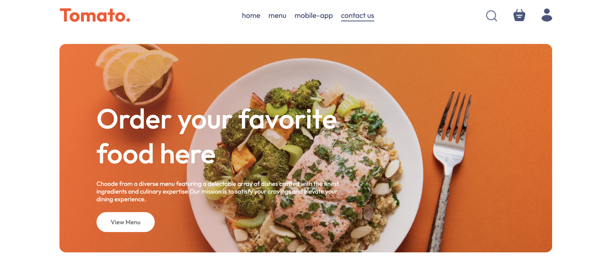
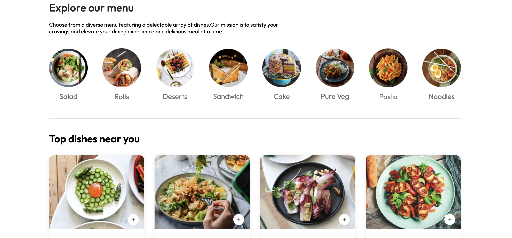
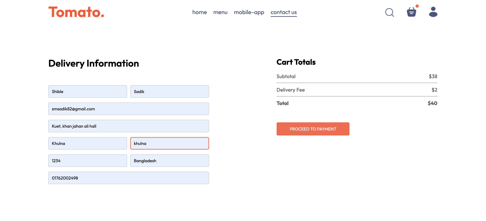
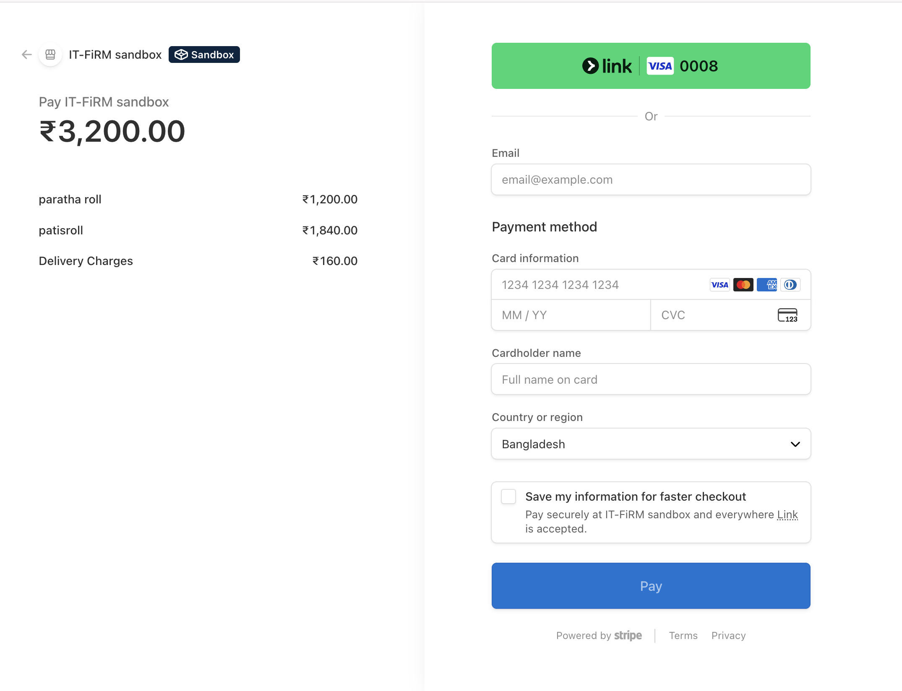
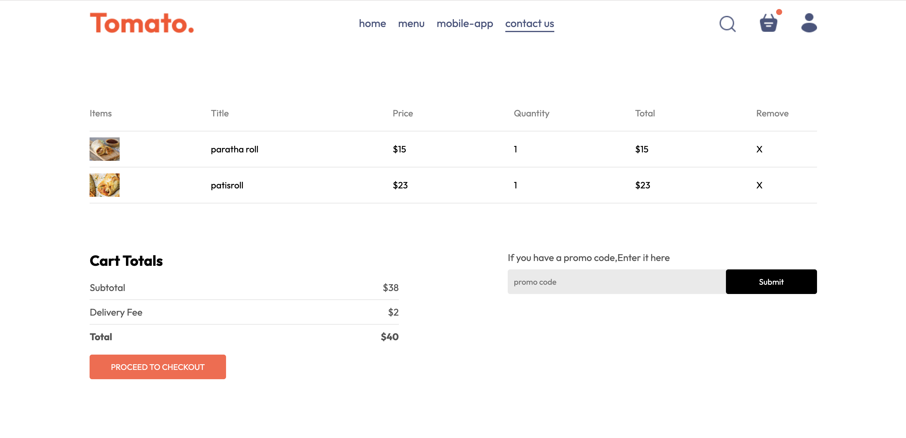
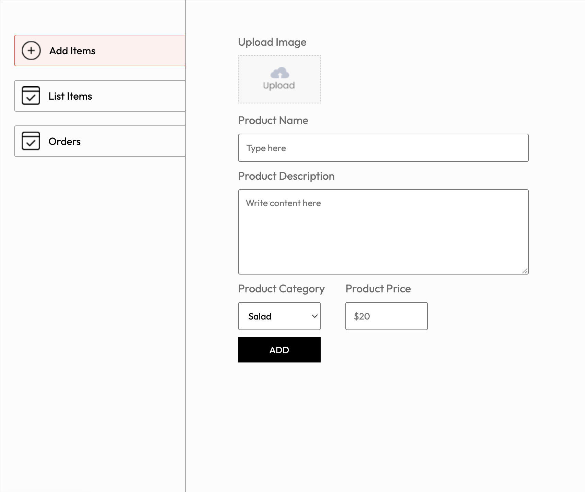
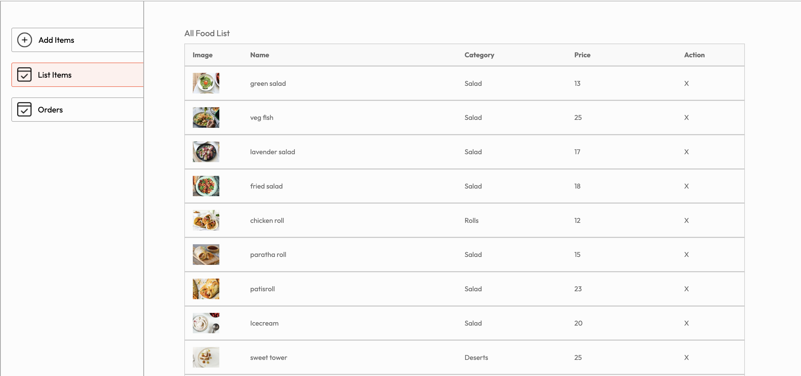
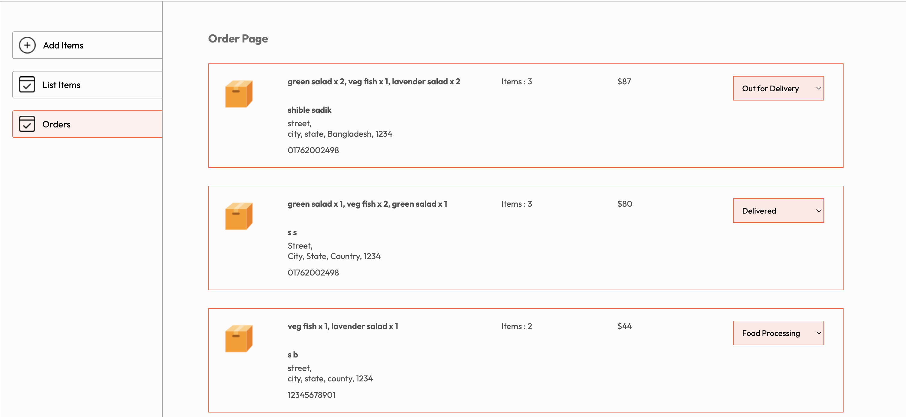

# 🍔 Foody  

A full-stack food delivery web application built with the MERN stack. Users can browse food items, add them to the cart, place orders with Stripe payment, and track order status. Includes an admin panel for managing food items and orders.  

---

## 🚀 Features  
- User Authentication (Sign up / Login)  
- Responsive Frontend Food Ordering Website  
- Shopping Cart Functionality  
- Place Order with Stripe Payment Gateway  
- User Order History Page  
- Admin Panel for Food Management  
- Display & Update Orders in Admin Panel  
- MongoDB Atlas Integration  

---

## 🛠 Tech Stack  
**Frontend:** React.js, React Router, CSS  
**Backend:** Node.js, Express.js  
**Database:** MongoDB Atlas  
**APIs / Libraries:** Stripe API, Axios, JWT Authentication  

---

## ⚙️ Installation Instructions  

1. **Clone the repository**  
   ```bash
   git clone git@github.com:shiblesadik603/Foody.git
   cd Foody

## Install dependencies  

1. **For backend:**  
   ```bash
   cd backend
   npm install
2. **For frontend:**  
   ```bash
   cd frontend
   npm install

## ▶️ Run the App Locally  

1. **Start backend server:**  
   ```bash
   npm run server
2. **Start frontend:**  
   ```bash
   npm run dev

## 📸 Screenshots

## **Server-Client**







## **Admin**






